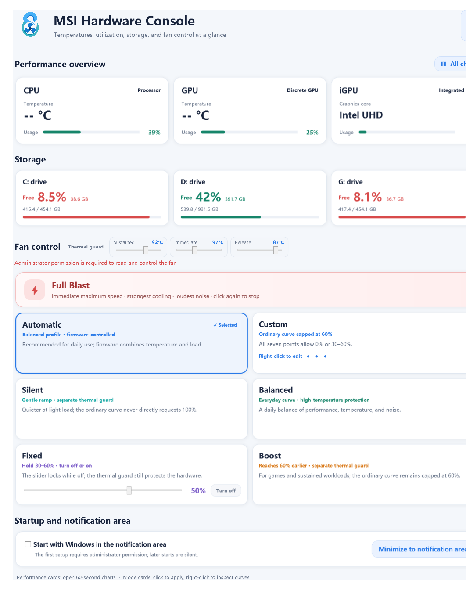

# MSI Hardware Console

**English** · [简体中文](README.zh-CN.md)

An unofficial, lightweight Windows dashboard and MSI laptop fan controller. It shows CPU/GPU utilization and temperatures, storage usage, fan RPM, fan modes, and editable temperature-to-fan curves without requiring MSI Center.

> [!WARNING]
> Fan control writes to firmware through MSI's ACPI WMI interface. Hardware support is model-specific. Version 0.1.3 enables fan writes only on the verified MSI Cyborg 15 A13VE with WMI interface 2.8; other systems run in monitoring-only mode.



## Why this project exists

MSI Center is much larger than the small set of features many laptop owners use every day. MSI Hardware Console focuses on a compact dashboard, transparent fan behavior, notification-area startup, and direct firmware read-back.

It is worth sharing as an early open-source utility for owners of the verified model and as a foundation for carefully adding more MSI models. It is **not** a universal MSI Center replacement yet.

## Features

- CPU, NVIDIA discrete-GPU, and Intel integrated-GPU utilization
- CPU and discrete-GPU temperatures from MSI WMI
- Task Manager-style 60-second charts inside the current window
- Storage free space and used-capacity bars
- Live fan RPM and firmware performance profile
- Automatic, Silent, Balanced, Boost, Fixed, Custom, and Full Blast controls
- Editable seven-point temperature/fan curve
- Safe normal-duty range: fan-off or 30–60%; sustained high temperature enables Full Blast protection
- English by default, with immediate Simplified Chinese switching
- Rounded light UI, notification-area operation, and optional elevated startup
- Title-bar minimization stays on the taskbar; closing to the notification area preserves a maximized window for the next open
- No MSI Center, MSI Center SDK, or kernel driver dependency

## Compatibility

| Area | Status |
|---|---|
| Windows 10/11 x64 performance and storage monitoring | Expected to work broadly |
| MSI Cyborg 15 A13VE, MSI WMI 2.8, single fan | Fan read/write verified |
| Other MSI laptops exposing `MSI_ACPI` | Monitoring may work; fan writes are locked |
| Multiple-fan laptops | Not supported yet |
| MSI desktops and non-MSI computers | Performance monitoring only; no fan control |

The firmware protocol is not uniform across MSI generations. Linux kernel documentation notes that fan sensors can expose multiple readings and warns that unsafe embedded-controller access can cause unwanted behavior. This project therefore uses an explicit allowlist instead of guessing.

See [COMPATIBILITY.md](docs/COMPATIBILITY.md) before requesting support for another model.

## Download and use

1. Download `MSI-Hardware-Console-v0.1.3-win-x64.zip` from GitHub Releases.
2. Extract the entire archive.
3. Run `MSIHardwareConsole.exe` and approve the Windows administrator prompt.
4. The public build starts in English. Click **中文** in the upper-right corner to switch languages.
5. On verified hardware, click a fan-mode card to apply it. Right-click a manual mode to inspect its curve or Automatic to read its firmware-policy explanation.
6. Choose **Automatic** before uninstalling or when you want to return fan control to firmware.

The executable is currently unsigned, so Windows SmartScreen may show an unknown-publisher warning. Verify the SHA-256 value attached to the GitHub release.

## Fan-control behavior

- `Automatic` returns fan decisions to MSI firmware and does not claim a fixed percentage curve that firmware does not expose.
- `Silent`, `Balanced`, and `Boost` write verified seven-point curves.
- `Fixed` holds a normal fan duty from 30–60%. Its button toggles the fan off and back on; the slider is disabled while off and restores the previous duty when enabled.
- All seven `Custom` points allow 0% or 30–60%; ordinary curves never request 100%.
- Three thermal-guard temperatures are adjustable beside the **Fan control** heading: sustained trigger (88–94°C, 20 seconds), immediate trigger (95–100°C), and release threshold (75–89°C, 20 seconds).
- Safety normalization keeps the immediate trigger at least 3°C above the sustained trigger and the release threshold at least 3°C below it.
- `Full Blast` directly enables the firmware's maximum-speed bit.

Ordinary curve values from 61–99% are intentionally unavailable because the verified firmware caps its normal curve range at roughly 60%. Showing unavailable values would be misleading.

## Build from source

Requirements:

- Windows 10 or 11 x64
- .NET Framework 4.x compiler included with Windows
- PowerShell 5.1 or later

```powershell
Set-ExecutionPolicy -Scope Process Bypass
.\build.ps1
```

Output is written to `dist\`, and the portable release archive is written to `artifacts\`.

## Safety and privacy

- The production executable requests administrator permission because MSI WMI fan writes require elevation.
- Startup uses a highest-privilege Task Scheduler entry only when the user enables it.
- No telemetry, analytics, account, cloud service, or network connection is used.
- Unknown hardware is monitoring-only by default.
- The project does not patch firmware or install a kernel driver.

Please read [SECURITY.md](SECURITY.md) before testing hardware changes.

## Contributing

Compatibility reports are welcome, but do not submit a model as “supported” based only on a successful WMI connection. A useful report needs model name, BIOS/EC firmware, WMI version, fan count, curve write/read-back, RPM behavior, and a confirmed return to Automatic mode.

See [CONTRIBUTING.md](CONTRIBUTING.md).

## Technical references

- [Linux kernel: MSI WMI Platform Features](https://docs.kernel.org/wmi/devices/msi-wmi-platform.html)
- [msi-ec project](https://github.com/BeardOverflow/msi-ec)
- [YAMDCC](https://github.com/Sparronator9999/YAMDCC), another lightweight MSI Center alternative

## License and trademark

GPL-3.0-or-later. See [LICENSE](LICENSE).

MSI and MSI Center are trademarks of Micro-Star INT'L CO., LTD. This community project is not affiliated with, endorsed by, or supported by MSI.

---

## 中文简介

MSI Hardware Console 是一个非官方的轻量 Windows 硬件面板，可显示 CPU/GPU 占用率与温度、硬盘空间、风扇转速，并在兼容机型上直接设置风扇模式和温度曲线，不依赖 MSI Center。

公开版默认英文，可在右上角即时切换简体中文。0.1.3 版本只确认支持 **MSI Cyborg 15 A13VE、WMI 2.8、单风扇**；其他电脑默认锁定风扇写入，仅提供监控，避免在未验证固件上冒险操作。

完整中文说明见 [README.zh-CN.md](README.zh-CN.md)。
