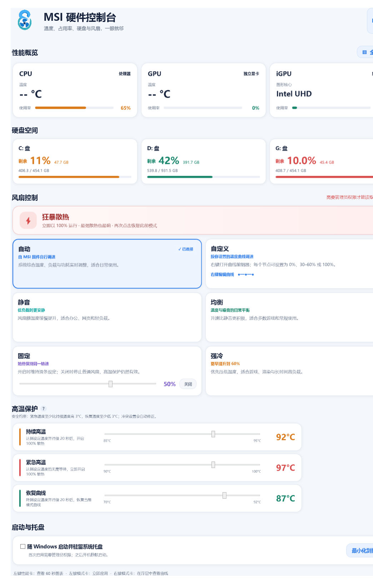

# MSI Hardware Console

[English](README.md) · **简体中文**

一个非官方的轻量 Windows 硬件面板和 MSI 笔记本风扇控制工具。它无需安装 MSI Center，即可显示 CPU/GPU 占用率与温度、硬盘空间、风扇 RPM、风扇模式，以及可编辑的温度—转速曲线。

> [!WARNING]
> 风扇控制会通过 MSI ACPI WMI 接口写入固件，兼容性与具体机型密切相关。0.1.2 只会在已经验证的 MSI Cyborg 15 A13VE、WMI 2.8 上启用风扇写入；其他电脑默认进入仅监控模式。



## 为什么值得公开

很多用户每天只需要 MSI Center 中很少的一部分功能。这个项目专注于清晰的硬件概览、明确的风扇行为、托盘后台运行，以及写入后的固件回读验证。

它目前值得作为“已验证机型可用、欢迎谨慎扩展兼容性”的早期开源工具分享，但还不能被宣传为通用 MSI Center 替代品。

## 主要功能

- CPU、NVIDIA 独立显卡和 Intel 集成显卡占用率
- 通过 MSI WMI 读取 CPU 与独显温度
- 在当前窗口浮层中显示类似任务管理器的 60 秒图表
- 硬盘剩余空间和已用空间进度条
- 实时风扇 RPM 与固件性能档位
- 自动、静音、均衡、强冷、固定、自定义和狂暴散热
- 可编辑的七点温度—风扇曲线
- 普通转速限定为关闭或 30–60%；持续高温时启用狂暴散热保护
- 公开版默认英文，可即时切换简体中文
- 浅色圆角界面、托盘后台运行和可选的最高权限开机自启
- 标题栏最小化只进入任务栏；关闭到托盘后，下次打开会保留原来的最大化状态
- 不依赖 MSI Center、MSI Center SDK 或内核驱动

## 兼容范围

| 范围 | 状态 |
|---|---|
| Windows 10/11 x64 性能与硬盘监控 | 预期广泛可用 |
| MSI Cyborg 15 A13VE、MSI WMI 2.8、单风扇 | 风扇读写已验证 |
| 其他带有 `MSI_ACPI` 的 MSI 笔记本 | 监控可能可用；风扇写入默认锁定 |
| 多风扇笔记本 | 暂不支持 |
| MSI 台式机与非 MSI 电脑 | 仅性能监控，不控制风扇 |

MSI 不同代际固件的协议并不统一。Linux 内核文档也明确提醒，错误访问嵌入式控制器可能产生异常行为，因此本项目使用明确的机型白名单，不会通过猜测来开放写入。

为其他机型提交兼容性报告前，请先阅读 [COMPATIBILITY.md](docs/COMPATIBILITY.md)。

## 下载与使用

1. 从 GitHub Releases 下载 `MSI-Hardware-Console-v0.1.2-win-x64.zip`。
2. 完整解压压缩包。
3. 运行 `MSIHardwareConsole.exe`，同意 Windows 管理员权限提示。
4. 公开版默认使用英文，点击右上角 **中文** 即可切换。
5. 在已验证机型上，左键点击风扇模式会立即应用；右键点击手动模式可查看曲线，右键点击“自动”可查看固件策略说明。
6. 卸载前或希望恢复固件控制时，请选择“自动”。

目前可执行文件尚未进行代码签名，因此 Windows SmartScreen 可能显示“未知发布者”。请核对 GitHub Release 中提供的 SHA-256。

## 风扇控制规则

- “自动”把风扇决策交还 MSI 固件，不再显示固件并未公开的猜测百分比曲线。
- “静音”“均衡”“强冷”会写入经过验证的七点曲线。
- “固定”可持续保持 30–60%；按钮可在关闭和开启之间切换，关闭时滑条禁用变灰，重新开启后恢复上次设定。
- “自定义”的前六个节点只允许 0% 或 30–60%。
- 最后节点固定为 100% 安全触发点：达到该温度持续 10 秒后开启狂暴散热；至少再高 5°C（且不低于 90°C）时立即保护；降到 3°C 滞回点以下持续 10 秒后退出。
- “狂暴散热”直接开启固件的最高转速开关。

普通曲线不提供 61–99%，因为已验证固件会把普通曲线限制在约 60%；显示无法真正实现的数值会误导用户。

## 从源码构建

需要 Windows 10/11 x64、Windows 自带的 .NET Framework 4.x 编译器，以及 PowerShell 5.1 或更高版本。

```powershell
Set-ExecutionPolicy -Scope Process Bypass
.\build.ps1
```

程序输出到 `dist\`，便携发布包输出到 `artifacts\`。

## 安全与隐私

- 正式版需要管理员权限，因为 MSI WMI 风扇写入需要提升权限。
- 只有用户开启开机自启时，程序才会创建最高权限计划任务。
- 不包含遥测、分析、账号、云服务或网络连接。
- 未验证硬件默认只能监控。
- 不修改 BIOS，也不安装内核驱动。

测试硬件功能前请阅读 [SECURITY.md](SECURITY.md)。

## 贡献兼容性

欢迎提交机型报告，但仅仅“WMI 能连接”不能证明风扇控制安全。有效报告至少需要：完整机型、BIOS/EC 版本、WMI 版本、风扇数量、曲线写入与回读、RPM 行为，以及成功恢复自动模式的证据。

详见 [CONTRIBUTING.md](CONTRIBUTING.md)。

## 许可证与商标

GPL-3.0-or-later，详见 [LICENSE](LICENSE)。

MSI 与 MSI Center 是 Micro-Star INT'L CO., LTD. 的商标。本社区项目与 MSI 无隶属、背书或官方支持关系。
